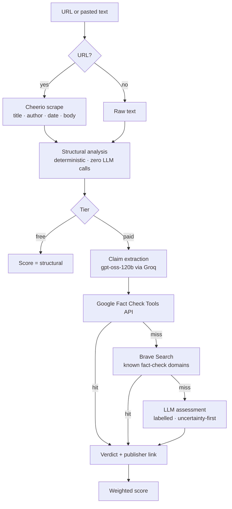
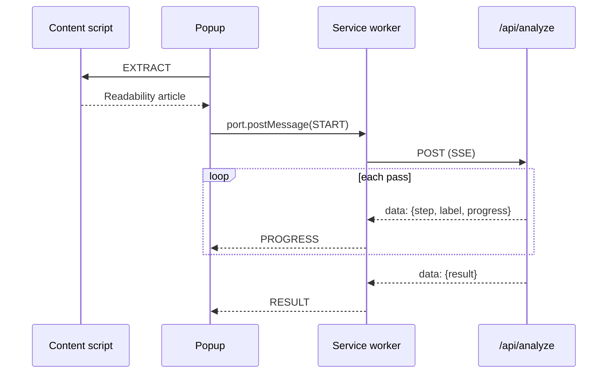

<div align="center">


# Quanta

### *Truth, measured.*

**A news credibility instrument.** Paste a URL or an article, and Quanta pulls out the checkable claims, looks each one up against independent fact-checkers, measures the structural trust signals of the page itself, and streams back a 0–100 report that shows its work.

[**Live app**](https://factnews-six.vercel.app) · [Analysis pipeline](#how-the-analysis-works) · [Architecture](#architecture) · [Run it locally](#run-it-locally)


</div>

---


<div align="center"><sub>Soft rebrand: cream, dark teal and lilac, with a fluffy Fredoka wordmark. The right-hand panel is a real thing, not decoration — move the cursor and it samples a reading, and the structural/claims sub-scores it prints are computed from the same 0.3/0.7 formula the report uses, not made up. The numbers streaming past it are the same illustrative vocabulary as the "Try" links below the input, not live telemetry.</sub></div>

---

## The problem it solves

Most "AI fact-checkers" ask a language model whether an article is true and print the number it makes up. That number is unfalsifiable and often wrong.

Quanta is built the other way around:

| | |
|---|---|
| **Deterministic first** | Byline, publish date, TLD, ALL-CAPS ratio, exclamation density and length are computed in plain TypeScript — no model, no variance, no API cost. This alone is the whole free tier. |
| **Grounded second** | Claims are checked against the **Google Fact Check Tools API** — real verdicts from PolitiFact, FactCheck.org, Full Fact, AFP — with **Brave Search** as a fallback. Every verdict that came from a database links back to the publisher that issued it. |
| **Model last, and labelled** | The LLM only gets the final word on claims that no fact-checker has covered, and the UI marks those cards `AI assessment` instead of `Fact-check database`. The prompt is explicitly instructed to answer `UNVERIFIED` rather than guess. |

The score is arithmetic over those verdicts, not a vibe. You can read the formula in [`lib/analyze.ts`](lib/analyze.ts) and reproduce it by hand.

---

## See it work

### 1 · Paste a URL or the article text

The nav's history button opens the archive — every pass you've run. No account needed; it's kept in `localStorage` and never leaves the browser. Sign in and the same archive moves server-side instead, so it follows you across devices — see [Accounts & billing](#accounts--billing).

### 2 · Watch it think

The API is a **Server-Sent Events** stream, so the UI names each step as the server reaches it, and mirrors the raw frames on the right. Nothing is a fake progress bar — each line there is a frame that actually arrived off the wire.


### 3 · Read the verdict

A live BBC piece on a festival cancellation in Tigray, scored 90/100 — "reliable," one structural flag (no byline), five claims checked and none of them pre-existing in a fact-check database, so every verdict below is a labelled AI assessment.


Run the same pipeline over an anonymous, ALL-CAPS, exclamation-heavy pasted text and the structural score collapses to 40 — four flags, −60 — and this time the overall follows it down to 52, "questionable," because two of the three claims came back confidently *false*. Compare that against the dark-mode run below, where the claims pass is what saves an otherwise-similar structural score from collapsing further: same shape of penalty, opposite direction, because the formula doesn't know which way a given article will break — only the two passes, weighted 30/70, arithmetic all the way down.


<sub>Full-length version: [high-scoring](docs/screenshots/report-high-full.png) · [low-scoring](docs/screenshots/report-low-full.png)</sub>

### 4 · Every claim, with its receipt

The claim ledger is an accordion, not a card grid — click a row and it opens in place. Each one carries a verdict, a confidence, and either a publisher link or an honest `No external source found` when the assessment came from the model instead.


### 5 · Structural signals, computed not guessed


### 6 · In the dark

The whole interface is painted from CSS custom properties, so dark mode is a token swap in one stylesheet rather than a second set of components — including the fixed dark-teal instrument panels (nav, claim ledger), which stay a "hardware panel" surface in *both* themes on purpose while everything else — paper, ink, the accent color itself — flips. This run pastes in a paragraph of common health and election misinformation and shows two real fact-check-database hits: FactCheck.org rated both the vaccine-microchip and stolen-election claims "False," which is why they're marked `FACT-CHECK DATABASE` instead of the model's own assessment — the third claim, about 5G and coronavirus, had no database match and fell through to a labelled AI assessment instead.


### 7 · Source dossier

32 outlets are profiled locally — credibility score, editorial lean, track record, and the standing fact-checker note. Unknown domains degrade gracefully to "source database not consulted" rather than inventing a rating.


---

## The Chrome extension

Same engine, measured against whatever tab you're on. Mozilla **Readability** extracts the article in a content script, the popup drives the run, and an **MV3 service worker** holds the SSE connection — so the analysis survives the popup being closed, which is the thing MV3 popups are notorious for breaking.

<table>
<tr>
<td width="33%"></td>
<td width="33%"></td>
<td width="33%"></td>
</tr>
<tr>
<td align="center"><sub><b>Detect</b> — Readability finds the article on the current tab</sub></td>
<td align="center"><sub><b>Measure</b> — live steps proxied through the service worker</sub></td>
<td align="center"><sub><b>Report</b> — score, breakdown, signals, red flags</sub></td>
</tr>
</table>

---

## Accounts & billing

Signing in is optional — every feature above works anonymously, rate-limited by IP. An account (Supabase auth, email + password) adds:

- **Server-side history.** [`lib/history.ts`](lib/history.ts) is dual-mode: signed in and Supabase configured → reads and writes a Postgres `analyses` table, row-level-security-scoped to the caller regardless of what the client claims. Signed out, or Supabase not configured → the same `localStorage` behavior the app always had. No regression for anonymous use, no second data model to keep in sync.
- **A real paid tier.** `resolveTier()` in the API route reads `profiles.tier` for the signed-in user instead of trusting anything the client sends. **Lemon Squeezy** checkout and a signature-verified webhook ([`app/api/webhooks/lemonsqueezy/route.ts`](app/api/webhooks/lemonsqueezy/route.ts)) keep that column in sync with the actual subscription — the Supabase user id rides along as `custom_data.user_id` on the checkout and comes back on every later webhook event, so Lemon Squeezy never needs to know anything about the account system.
- **`/account`** — plan and subscription status, a link into the Lemon Squeezy billing portal, a language preference, and sign-out.

Missing configuration degrades the same way every other integration in this project does: no Supabase → `resolveTier()` returns `paid` for everyone and history stays local; no Lemon Squeezy keys → checkout responds `503` instead of taking the page down.

---

## Landing page

A separate marketing surface at [`/landing`](https://factnews-six.vercel.app/landing). It predates the soft rebrand and hasn't been carried over yet — `components/marketing/` still runs its own `COLORS`/`FONTS`/`SPACING` constants rather than `globals.css`'s tokens, which is why it doesn't match the cream/dark-teal/lilac palette everywhere else in this README.


<sub>The figures in the trust strip are illustrative placeholder copy, not live metrics.</sub>

---

## How the analysis works



Every arrow above is one SSE frame to the client.

### Scoring

```
structural:  100 − Σ penalties          high = 20 · medium = 10 · low = 5
claims:      100 − mean(verdict penalty) FALSE 60 · MISLEADING 40 · MIXED 20
                                         UNVERIFIED 10 · TRUE 0

free   →  structural
paid   →  structural × 0.3  +  claims × 0.7
```

Structural weight is deliberately low: a well-formatted lie should not outscore a scruffy truth.

---

## Architecture

```
app/api/analyze/route.ts           SSE endpoint · CORS · rate limit · scrape → stream
app/api/checkout/route.ts          Lemon Squeezy checkout · Supabase user id round-trips via custom_data
app/api/billing-portal/route.ts    Lemon Squeezy customer-portal link
app/api/webhooks/lemonsqueezy/     signature-verified subscription sync → profiles.tier
app/api/share/route.ts             validates + size-caps a result, inserts it as an unlisted public row
app/report/[id]/                   server-rendered public report page · generateMetadata for OG tags
app/account/, app/auth/            account settings · sign-in/up · callback · sign-out
lib/supabase/                      client · server · admin clients · RLS-scoped auth context
supabase/migrations/               profiles → analyses → shared_reports, run by hand in order
lib/urlGuard.ts                    SSRF guard on scraped URLs     (blocks private/link-local, re-checks redirects)
lib/structural.ts                  deterministic signals          (no network)
lib/groq.ts                        shared LLM client              (retry, fence + JSON recovery)
lib/claims.ts                      claim extraction               (Groq)
lib/factcheck.ts                   Google Fact Check → Brave      (graceful null on miss)
lib/analyze.ts                     async generator orchestrating the passes
lib/synthesize.ts                  last-resort model assessment   (Groq, never throws)
lib/errorMessages.ts               API error code → translated copy
lib/sourceDatabase.ts              32 outlets: score, lean, record
lib/history.ts                     dual-mode: Postgres (signed in) ↔ localStorage (anonymous)
components/                        report UI · claim ledger · history drawer · marketing
extension/                         MV3: content script · service worker · popup
```

Each of `structural`, `claims`, `factcheck` and `synthesize` is a pure module with one job, and `analyze.ts` is an `AsyncGenerator` that yields typed frames — which is why the same engine drives the web UI and the extension without a second code path.

### Extension IPC



The long-lived `chrome.runtime.Port` lives in the service worker on purpose: MV3 kills the popup on blur, and a `fetch` started there dies with it.

---

## Engineering decisions worth reading

- **SSE, not WebSockets.** The stream is one-directional and the deployment target is Vercel serverless. A `ReadableStream` response needs no upgrade handshake, no connection state, no extra infrastructure.
- **An `AsyncGenerator` as the analysis contract.** The pipeline yields `{type:'step'}` and `{type:'result'}` frames; the route just serialises them. Adding a pass changes one file, and the tests iterate the generator directly without touching HTTP.
- **Every external service degrades into the next one.** No `GOOGLE_FACT_CHECK_API_KEY` → the lookup returns `null` and the chain falls through to Brave, then to the model. No Upstash → rate limiting falls back to an in-process `Map`. Missing keys quietly reduce the depth of the analysis instead of breaking the request.
- **Transient upstream failures don't sink the run.** Groq calls retry with backoff on 429/5xx and network errors, honouring `Retry-After`; a claim whose assessment can't be parsed degrades to `UNVERIFIED` rather than failing the whole report.
- **Prompts that are allowed to say "I don't know."** The synthesis prompt mandates `UNVERIFIED` with low confidence over a guess, and forbids fabricated citations — the failure mode that makes most LLM fact-checkers useless.
- **Provenance is a first-class field.** `source: 'factcheck_db' | 'web_search' | 'llm_assessment'` travels with every verdict all the way into the UI, so a reader always knows whether a claim was checked or merely assessed.
- **The extension's service worker inlines its constants.** Chrome MV3 module service workers can fail registration (`Status code: 2`) when imports cross generated chunk boundaries — a real bug hit and fixed here, documented in the file.
- **A caller-supplied URL is treated as an attack surface.** The endpoint fetches whatever URL it is handed from inside the deployment and returns the body, so `lib/urlGuard.ts` rejects non-http schemes, private and link-local addresses (including IPv4-mapped IPv6), and hostnames whose DNS answers point anywhere internal. Redirects are followed by hand so every hop is re-checked.
- **The quota is refunded when the work never happened.** Validation runs before a slot is claimed; the scrape runs after, and a dead link or a paywall hands the slot back rather than costing one of three daily analyses.
- **Errors carry a code, not a stack.** Failures travel as a typed `code` plus a fallback sentence; each client renders its own translated copy, and internal strings never reach the screen.
- **The LLM provider is one constant, not a scattered assumption.** When Groq retired `llama-3.3-70b-versatile` from its catalog mid-project, every call site kept working off one swap in `lib/groq.ts` — including the `reasoning_effort` tuning the replacement model needs to keep its chain-of-thought from eating the whole token budget before emitting an answer.
- **The webhook verifies signature before anything else touches the body.** Lemon Squeezy's `X-Signature` header is checked against the raw request bytes with `timingSafeEqual`, not `===` — a naive comparison leaks how many leading bytes an attacker's guess got right, one request at a time.
- **An inline style always outranks an external stylesheet rule of equal selector weight, media query or not.** This defeated a focus ring and a responsive layout rule twice in the same audit pass before the fix moved the property in question into CSS itself instead of trying to override it from further down the cascade.
- **A shared report is a snapshot with no owner, on purpose.** `shared_reports` has no `user_id` and a permissive RLS policy (`insert`/`select` both `using (true)`) instead of the ownership model `analyses` uses — sharing doesn't require an account, so there's no user to scope the row to. `app/api/share/route.ts` is what actually gates it: shape validation and a size cap, not RLS, is the abuse boundary here.

---

## Also in the box

- **Rate limiting** — every request: 3 analyses per 24h per extension install, 10 per 24h per IP, backed by Upstash Redis with an in-memory fallback
- **Dark mode** — a full token palette, a toggle in the nav, and a pre-paint script so the theme never flashes
- **English + Arabic** — message catalogues with a language selector, a persisted choice, and `lang`/`dir` on the document root
- **History** — server-side and cross-device for signed-in users, `localStorage` otherwise; either way it's version-guarded, so reports written by a previous scoring engine are discarded rather than mis-rendered
- **Shareable report links** — the Share button on any report (no account needed) snapshots the result into a public, unlisted `/report/[id]` page with its own OG tags for link previews; `noindex`, so it's linkable without becoming search-indexed content
- **Accounts & billing** — Supabase auth, Postgres profiles behind row-level security, Lemon Squeezy checkout and a signature-verified webhook — see [Accounts & billing](#accounts--billing)
- **SEO** — OG image, `sitemap.ts`, `robots.ts`, full Open Graph and Twitter metadata
- **Tests** — 150 Vitest cases across 10 files: the analysis generator (free/paid frames, verdict scoring, missing-key failure), the Groq client (retry on 429 and network error, no retry on 4xx, fence stripping, JSON recovery), structural scoring, verdict normalisation, the SSRF guard, the scraper, history's dual-mode read/write path, the Lemon Squeezy webhook (signature verification, status mapping, missing-user-id handling), the share route (shape validation, size cap, degraded-Supabase handling), and the analyze route end to end (validation, streaming, rate-limit buckets, quota refunds)

---

## Run it locally

```bash
npm install
cp .env.local.example .env.local     # add keys — all of them optional except Groq
npm run dev                          # http://localhost:3000
npm test                             # vitest
npm run check                        # typecheck + lint + test
```

| Variable | Needed for | Without it |
|---|---|---|
| `GROQ_API_KEY` | claim extraction + synthesis | free tier still works; paid tier errors |
| `GOOGLE_FACT_CHECK_API_KEY` | grounded verdicts w/ publisher links | falls through to Brave |
| `BRAVE_SEARCH_API_KEY` | fallback fact-check search | falls through to the model |
| `UPSTASH_REDIS_REST_URL` / `_TOKEN` | rate limits that survive a deploy | in-memory `Map` |
| `NEXT_PUBLIC_SUPABASE_URL` / `_ANON_KEY` | accounts, server-side history | signed-out everywhere; `resolveTier()` returns `paid` for all traffic |
| `SUPABASE_SERVICE_ROLE_KEY` | webhook writes to `profiles` (bypasses RLS — server-only, never `NEXT_PUBLIC_`) | webhook can't update subscription status |
| `LEMONSQUEEZY_API_KEY` / `_STORE_ID` / `_VARIANT_ID` / `_WEBHOOK_SECRET` | checkout + subscription sync | `/api/checkout` returns `503` |

If you're pointing at your own Supabase project, run the SQL files in [`supabase/migrations/`](supabase/migrations/) in order, by hand, in the Supabase SQL editor — `profiles` and its signup trigger, then `analyses`, then `shared_reports`. Skipping one only breaks the corresponding feature (accounts, history, or the Share button, respectively, each failing with its own contained error) rather than the app around it.

### Extension

```bash
cd extension && npm install && npm run build
```

Load `extension/dist` at `chrome://extensions` with Developer Mode on. To point it at a local server, uncomment `API_BASE_URL` in [`extension/src/lib/config.ts`](extension/src/lib/config.ts) and add the origin to `host_permissions` in [`extension/manifest.json`](extension/manifest.json).

---

## Honest limitations

This is a working prototype, not a finished product. Where it falls short:

- **Auth is real but minimal.** Email + password via Supabase, no OAuth providers, no self-service account deletion, no password-reset UI beyond Supabase's default email template. `resolveTier()` reads `profiles.tier` server-side rather than trusting the client, but if Supabase isn't configured at all it falls back to `paid` for everyone — the rate limit, not a subscription, is what bounds an unconfigured deployment.
- **The score is uncalibrated.** The weights are reasoned, not fitted, and 30/70 is a judgment call rather than something derived from a labelled dataset. Nothing stops a future run where a clean structural pass sits next to a claims pass that declines to confidently call anything false, landing well above what the article deserves — the same asymmetry that makes the claims pass 70% of the weight in the first place also means "as designed" isn't yet "validated against ground truth."
- **The source database is a hand-curated file.** 32 outlets, no update mechanism.
- **Anonymous history is still `localStorage`.** Signing in gets you server-side, cross-device history; skip that and clearing the browser still clears the record, same as before accounts existed.
- **Scraping fails on hard targets.** Paywalls, heavy JS, bot protection.
- **The marketing landing page uses illustrative figures**, not live product metrics.
- **Quanta is a reading aid, not an oracle.** It is at its most useful when it disagrees with your first instinct and shows you why.

## Roadmap

`OAuth providers + self-service account deletion` · `Calibration against a labelled set` · `Landing page rebrand` · `Firefox / Safari builds` · `Error tracking` · `Public API`

---

<div align="center">

Built with Next.js, TypeScript and Groq · MIT licensed

<sub>Every report screenshot above is a real analysis of a live article or a real pasted text, captured from the running app.</sub>

</div>
